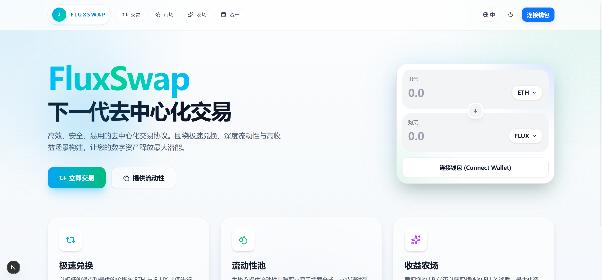
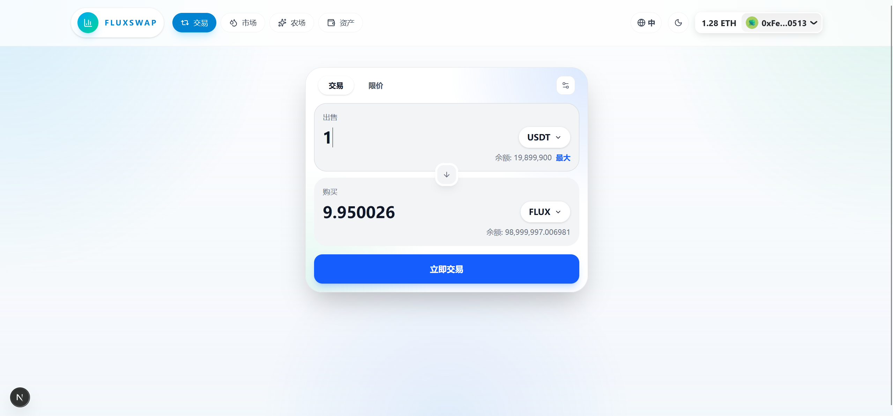
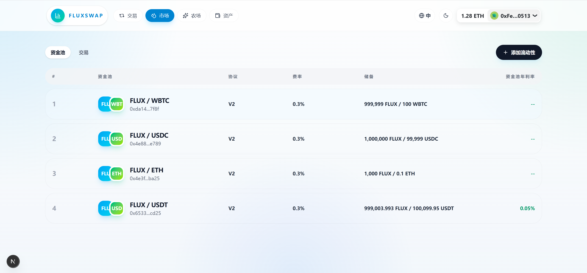
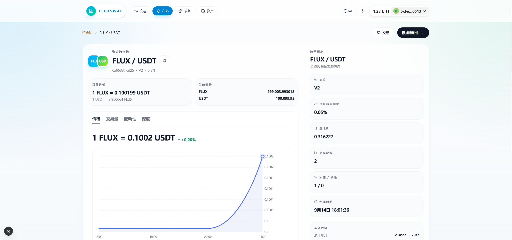
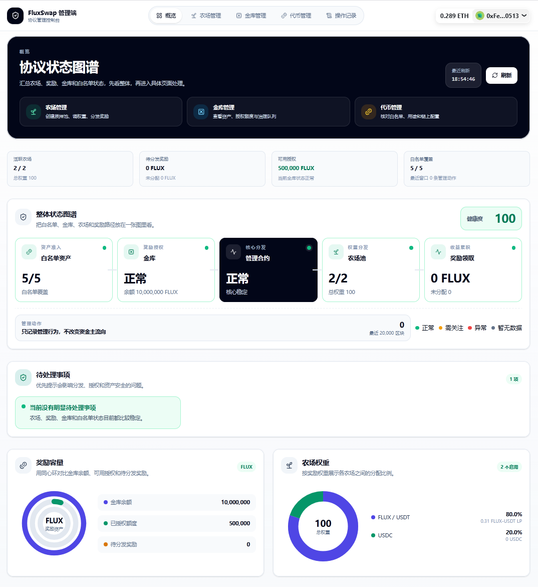
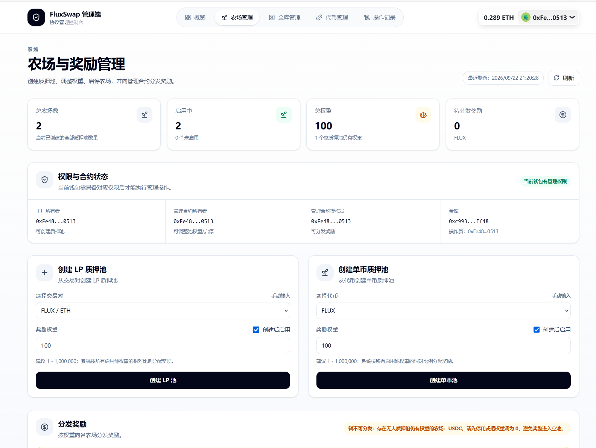
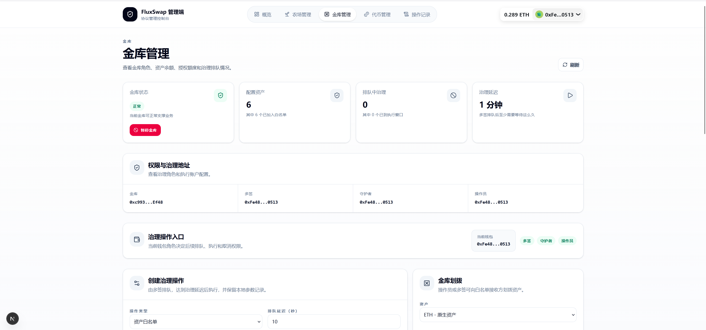
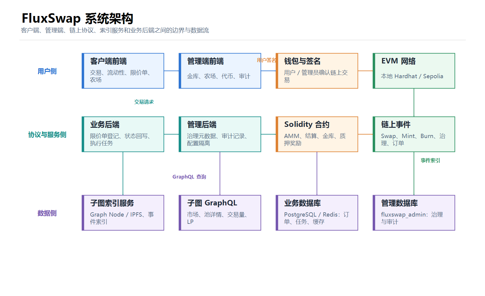
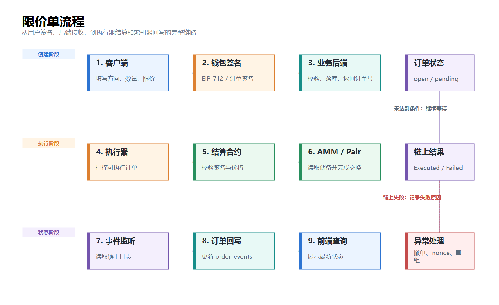
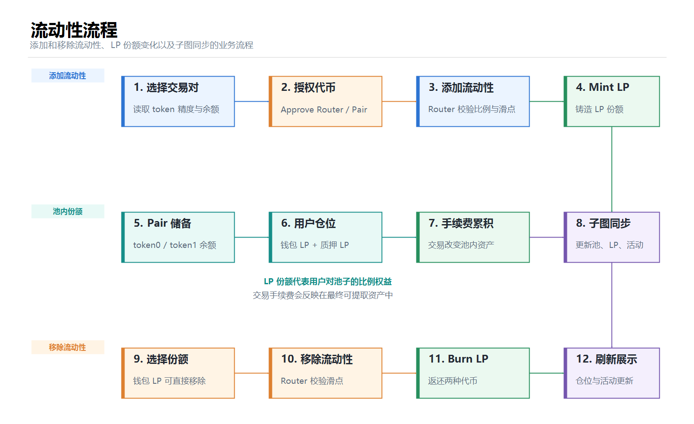

  <h1>FluxSwap</h1>
  
一个包含 AMM 交易、流动性管理、限价单、农场和金库治理的全栈 DEX 项目

  
  
  
  
  

FluxSwap 是一个面向 EVM 网络的去中心化交易所练习项目，围绕“链上协议 + 业务后端 + 子图索引 + 客户端 + 管理端”完整实现一套 DEX 产品。项目重点不只是完成页面，而是把交易、流动性、限价单执行、质押奖励和协议治理串成可运行的业务闭环。

## 项目亮点

- 自研 AMM、交易对、路由、LP Token 和流动性管理合约。
- 支持 ERC20 兑换、添加流动性、移除流动性和 LP 仓位展示。
- 支持 EIP-712 限价单签名，由后端执行器扫描并提交链上结算交易。
- 通过索引器和 order_events 记录限价单执行、撤单、nonce 作废等状态变化。
- 支持 LP 质押、单币质押、奖励分发、领取和解除质押。
- 通过金库治理管理白名单、授权额度、每日支出额度和紧急操作。
- 提供独立管理端，用于农场、金库、代币和管理日志的运营检查。
- 使用 Graph Node / IPFS / PostgreSQL 索引交易对、Swap、Mint、Burn 和 Sync 事件。
- 支持本地 Hardhat 联调和 Sepolia 测试网部署。

## 功能展示

### 客户端

| 页面 | 说明 |
| --- | --- |
| 首页 / 交易 | 连接钱包、选择代币、查看报价并发起兑换 |
| 市场 | 查看交易对、TVL、交易量、流动性和资金池年利率 |
| 资金池详情 | 查看价格、交易量、流动性和深度图表 |
| 资产 | 查看代币余额、LP 仓位和限价单 |
| 农场 | 切换 LP 质押和单币质押，查看奖励并进行质押操作 |
| 限价单 | 创建、查看、展开详情和撤销限价单 |

### 管理端

| 页面 | 说明 |
| --- | --- |
| 概览 | 查看协议健康度、奖励容量、农场权重和管理事件频率 |
| 农场管理 | 创建 LP / 单币质押池、调整权重、启停池子和分发奖励 |
| 金库管理 | 管理资产白名单、授权、额度、治理队列和资金划拨 |
| 代币管理 | 对比前端配置与链上 ERC20 信息，检查协议使用情况 |
| 管理日志 | 查看近期农场和金库管理事件 |

## 系统架构

完整的架构说明、关键数据流和中文流程图见：[docs/architecture.md](docs/architecture.md)

### 限价单流程

### 流动性流程

## 目录结构

~~~text
FluxSwap-DEX/
├─ contracts/          Solidity 合约、Hardhat 配置、Ignition 部署脚本
├─ frontend/           用户客户端，Next.js
├─ admin-frontend/     协议管理端，Next.js
├─ backend/             限价单业务后端、执行器、索引器，Go
├─ admin-backend/       管理端后端、治理元数据和审计记录，Go
├─ subgraph/            Graph Protocol 子图和 GraphQL 索引
├─ docs/                架构说明和项目截图
├─ .gitignore
├─ LICENSE
└─ README.md
~~~

## 技术栈

### 链上部分

- Solidity
- Hardhat 3
- Hardhat Ignition
- OpenZeppelin Contracts
- viem / ethers
- EVM 网络：本地 Hardhat、Sepolia

### 客户端和管理端

- Next.js 16
- React 19
- TypeScript
- Tailwind CSS 4
- wagmi
- RainbowKit
- viem
- ECharts / Recharts

### 后端和数据层

- Go 1.25+
- gRPC / go-zero：限价单业务后端
- Gin：管理后端 HTTP API
- GORM
- PostgreSQL
- Redis
- Graph Node / IPFS
- AssemblyScript / Graph Protocol

## 核心业务链路

### 普通交易

1. 客户端读取代币余额、交易对储备和 Router 报价。
2. 用户通过钱包授权代币并签名交易。
3. Router 调用 Pair 合约完成兑换。
4. Pair 产生 Swap 和 Sync 事件。
5. 子图索引事件，客户端通过 GraphQL 更新市场和资金池页面。

### 添加和移除流动性

1. 用户选择交易对并输入两种代币数量。
2. 客户端根据储备、代币精度和滑点保护计算交易参数。
3. 用户授权 Router 后提交添加流动性交易。
4. Pair 铸造 LP 份额给用户，并产生 Mint、Transfer、Sync 事件。
5. 移除流动性时销毁 LP，按当前池内份额返还两种代币。
6. 子图同步池储备、LP 总量、用户仓位和活动记录。

### 限价单

1. 用户在客户端填写卖出数量、最低买入数量、触发价格、执行费上限和有效期。
2. 客户端通过 EIP-712 生成订单签名，不直接把用户私钥交给后端。
3. 后端校验订单哈希、签名、nonce、有效期和链配置后落库。
4. Executor 扫描可执行订单，重新读取市场价格、储备和执行费。
5. 满足条件后，Executor 调用限价单结算合约。
6. Settlement 合约校验签名和订单状态，再通过 Router / Pair 完成结算。
7. Indexer 监听 OrderExecuted、NonceInvalidated 等事件，更新订单和 order_events。
8. 客户端查询最新状态，展示执行中、已执行、已撤销、失败或重组恢复等状态。

### 质押和奖励

1. 管理员通过管理端创建 LP 质押池或单币质押池。
2. 管理员设置奖励权重并决定创建后是否启用。
3. 用户批准 LP 或单币资产后进行质押。
4. 奖励按照质押池权重和用户质押份额计算。
5. 管理员从金库向奖励管理合约分发奖励。
6. 用户可以领取奖励、解除质押或退出质押池。

### 金库治理

1. 多签或具备权限的钱包创建治理操作。
2. 治理操作在链上进入延迟队列。
3. 达到 readyAt 后，由具备执行权限的钱包执行。
4. 管理后端保存治理操作参数、链 ID、合约地址和审计记录，帮助管理端恢复详情。
5. 链上金库状态仍然是最终事实来源，管理后端不保管私钥，也不绕过钱包发交易。

## 本地开发环境

### 环境要求

- Node.js 22+
- npm
- Go 1.25+
- Docker Desktop
- MetaMask 或其他 EVM 钱包
- PowerShell、Bash 或同等终端

建议先安装依赖：

~~~powershell
cd contracts
npm install
cd ../frontend
npm install
cd ../admin-frontend
npm install
cd ../subgraph
npm install
cd ../backend
go mod download
cd ../admin-backend
go mod download
~~~

### 本地链启动顺序

需要打开多个终端窗口。以下命令都在对应子项目目录执行。

#### 1. 启动 Hardhat 节点

~~~powershell
cd contracts
npm run node:local
~~~

保持这个终端运行。它会提供本地 RPC，通常为 http://127.0.0.1:8545。

#### 2. 部署核心合约

新开终端：

~~~powershell
cd contracts
npm run deploy:core:localhost
~~~

如果要使用 Hardhat 内置网络而不是独立节点，可以使用：

~~~powershell
npm run deploy:core:local
~~~

本地链重启后链状态会重置，通常需要重新部署，并重新同步前端合约地址。

#### 3. 初始化本地协议状态

~~~powershell
npm run init:post-deploy:all:local
~~~

该步骤用于初始化代币、金库权限、奖励配置、限价单执行器和测试账户资产。若只想检查治理计划，可先使用：

~~~powershell
npm run init:post-deploy:plan:local
~~~

#### 4. 同步客户端合约地址和 ABI

~~~powershell
cd ../frontend
npm run contracts:refresh
~~~

如果只需要重新生成 ABI / 类型：

~~~powershell
npm run codegen
~~~

#### 5. 启动客户端和管理端

客户端：

~~~powershell
cd ../frontend
npm run dev
~~~

默认地址：http://localhost:3000

管理端新开终端：

~~~powershell
cd ../admin-frontend
npm run dev
~~~

默认地址：http://localhost:3001

#### 6. 启动限价单业务后端

后端 Docker Compose 会同时启动 PostgreSQL、Redis、迁移、RPC、Executor、Indexer 和 Router Graph 服务：

~~~powershell
cd ../backend
docker compose up -d --build
~~~

查看服务状态：

~~~powershell
docker compose ps
~~~

健康检查：

~~~powershell
Invoke-RestMethod http://localhost:9100/healthz
Invoke-RestMethod http://localhost:9101/healthz
Invoke-RestMethod http://localhost:9102/healthz
~~~

停止后端：

~~~powershell
docker compose down
~~~

#### 7. 启动管理后端

先准备 admin-backend/.env，再启动：

~~~powershell
cd ../admin-backend
docker compose up -d --build
~~~

健康检查：

~~~powershell
Invoke-RestMethod http://localhost:8081/api/health
~~~

停止管理后端：

~~~powershell
docker compose down
~~~

### 子图本地部署

子图需要 Graph Node、IPFS 和 PostgreSQL。相关服务启动后，在 subgraph 目录执行：

~~~powershell
npm run codegen
npm run build
npm run create-local
npm run deploy-local
~~~

如果本地子图已经存在，需要先删除再创建：

~~~powershell
npm run remove-local
npm run create-local
npm run deploy-local
~~~

deploy-local 上传失败时，优先检查 IPFS 是否能访问 http://localhost:5001，以及 Graph Node 是否能访问 http://localhost:8020。这类错误通常不是子图 TypeScript 编译问题，而是本地 IPFS / Graph Node 服务未启动或端口不可达。

## Sepolia 测试网部署

Sepolia 按单链部署处理。本项目不会把本地链和 Sepolia 的合约地址、数据库游标、子图数据或管理端治理记录混用。

### 1. 准备合约环境变量

在 contracts 目录创建本地 .env，填入自己的 RPC 和部署账户私钥。私钥只放在本机，不要提交到 Git，也不要写入 README、截图或公开仓库。

~~~dotenv
SEPOLIA_RPC_URL=
SEPOLIA_PRIVATE_KEY=
~~~

SEPOLIA_PRIVATE_KEY 一般使用钱包导出的 0x 开头私钥格式。它不是公钥，必须使用专门的测试钱包，不能使用存放真实资产的钱包。

### 2. 生成 Sepolia 部署参数

~~~powershell
cd contracts
npm run prepare:sepolia
~~~

检查 ignition/parameters/FluxCore.sepolia.local.json5 和 post-deploy-init.sepolia.local.json5 中的角色地址、WETH / Mock 代币配置和测试账户地址。

### 3. 部署核心合约

~~~powershell
npm run deploy:core:sepolia
~~~

记录部署输出中的合约地址，并确认部署账户有足够的 Sepolia ETH 支付 Gas。测试代币数量可以由初始化脚本铸造或分发，Sepolia ETH 主要用于交易手续费。

### 4. 执行部署后初始化

可以先检查计划：

~~~powershell
npm run init:post-deploy:plan:sepolia
~~~

然后按治理流程排期并执行：

~~~powershell
npm run init:post-deploy:schedule:sepolia
npm run init:post-deploy:execute:sepolia
~~~

Sepolia 的治理延迟仅适合联调。正式环境上线前，应改为符合安全要求的延迟，并确认多签、守护者、操作员和限价单执行器地址不是同一个临时账户。

### 5. 更新前端配置

将 Sepolia 的链 ID、子图地址和部署后的合约地址写入各自本地环境文件：

- frontend/.env.local
- admin-frontend/.env.local
- backend/executor.yaml 或 Docker 使用的 backend/executor.docker.yaml
- admin-backend/.env
- subgraph/subgraph.yaml

前端常用字段见各自 .env.example，包括：

~~~dotenv
NEXT_PUBLIC_CHAIN_ID=
NEXT_PUBLIC_SUBGRAPH_URL=
NEXT_PUBLIC_FLUX_SWAP_FACTORY=
NEXT_PUBLIC_FLUX_SWAP_ROUTER=
NEXT_PUBLIC_FLUX_SWAP_TREASURY=
NEXT_PUBLIC_FLUX_SIGNED_ORDER_SETTLEMENT=
NEXT_PUBLIC_FLUX_POOL_FACTORY=
NEXT_PUBLIC_FLUX_MULTI_POOL_MANAGER=
NEXT_PUBLIC_FLUX_TOKEN=
NEXT_PUBLIC_WETH=
~~~

### 6. 部署和验证子图

先确认 subgraph/subgraph.yaml 中的 network、Factory 地址和 startBlock 都对应 Sepolia，然后执行：

~~~powershell
cd subgraph
npm run codegen
npm run build
~~~

之后根据使用的 Graph Node / Studio 部署方式执行对应部署命令。部署完成后，把 GraphQL 查询地址配置到客户端所需的环境变量中。

## 配置和安全边界

- .env、.env.local、admin-backend/.env、私钥和完整 RPC URL 不应提交到仓库。
- backend/executor.docker.yaml 已作为 Docker 本地配置使用，不应把其中的执行器私钥提交到公开仓库。
- 客户端只负责用户签名，业务后端不会拿到用户私钥。
- Executor 私钥只用于执行已经由用户签名、且满足链上条件的限价单，不用于代替用户签名。
- 管理后端只保存治理元数据、会话哈希和审计记录，不保管管理员私钥。
- 生产环境必须配置管理员钱包白名单，不能使用本地环境的空白名单放行行为。
- 本地链重启后，旧合约地址、订单记录、子图数据和管理端治理元数据可能失效，应按本地链流程重新部署和清理。
- 任何发送到公开测试网或主网的交易，都应先确认网络、合约地址、接收地址和资产数量。

## 测试和质量检查

### Solidity

在 contracts 目录：

~~~powershell
npm test
npm run test:unit
npm run test:integration
npm run test:regression
npm run test:permissions-governance
npm run test:economic-security
npm run test:fuzz
npm run test:invariant
npm run test:static-analysis
~~~

### Go 后端

在 backend 或 admin-backend 目录：

~~~powershell
go test ./...
go vet ./...
~~~

### 客户端和管理端

客户端：

~~~powershell
cd frontend
npm run lint
npm run build
~~~

管理端：

~~~powershell
cd admin-frontend
npm run lint
npm run typecheck
npm run build
~~~

### 子图

在 subgraph 目录：

~~~powershell
npm run codegen
npm run build
npm test
~~~

## 常见问题

### 前端显示链上信息读取失败

依次检查：

1. 钱包是否连接到正确网络。
2. RPC 是否可以访问。
3. 前端环境变量中的链 ID 是否正确。
4. 合约地址是否是当前这次部署的地址。
5. 代币地址和子图网络是否对应当前链。

### 本地链重启后页面还显示旧数据

Hardhat 重启后链状态会回到初始状态，但浏览器、前端配置、后端数据库和子图数据不会自动全部重置。应重新部署合约、同步地址，并根据需要清理本地后端数据库和重新初始化子图。

### 限价单创建后一直没有执行

检查：

- 后端 RPC 是否健康。
- Executor 是否健康。
- executor.docker.yaml 中的 RPC、结算合约地址和执行器账户是否正确。
- 用户签名的订单是否已经过期。
- 当前市场价格是否满足触发条件。
- 用户余额和授权是否足够。
- Indexer 是否能通过 WebSocket RPC 监听结算事件。

### 子图部署时提示 IPFS fetch failed

这通常表示 Graph CLI 无法访问 IPFS，而不是映射代码编译失败。确认：

- IPFS 服务是否运行。
- http://localhost:5001 是否可访问。
- Graph Node 是否运行并使用同一套 IPFS 服务。
- Docker 端口是否映射正确。

### 管理端刷新失败

检查当前链和金库地址是否匹配。Sepolia RPC 对日志查询范围可能有限，管理端会优先读取管理后端已持久化的治理操作，并在历史日志查询失败时保留核心状态展示。生产环境应配置独立数据库和合理的同步回看区块数。

## 相关文档

- [系统架构说明](docs/architecture.md)
- [客户端说明](frontend/README.md)
- [管理端说明](admin-frontend/README.md)
- [限价单业务后端说明](backend/README.md)
- [管理后端说明](admin-backend/README.md)
- [后端数据库说明](backend/DB_SCHEMA.md)
- [许可证](LICENSE)

## 项目状态

当前项目已具备本地链和 Sepolia 测试网联调所需的主要模块，适合用于：

- DEX 全栈项目演示
- Solidity / EVM 合约开发实践
- Go Web3 后端和链上事件处理实践
- Next.js Web3 前端作品集
- 面试中的系统设计、交易执行和协议治理案例说明

项目仍然属于测试网和作品集阶段。正式生产环境还需要进一步完善多签流程、监控告警、密钥托管、RPC 高可用、数据库备份和更完整的安全审计。

## License

本项目使用 [MIT License](LICENSE)。
