# Integration 测试说明

本目录用于存放“集成测试”。

这里的集成测试重点是把多个合约按真实业务链路接起来，验证跨合约状态传递、资产流转、权限依赖和业务结果是否完整闭环。

这类测试通常有几个特点：
- 会同时部署 router、factory、treasury、manager、staking pool、buyback executor、distributor 等多个组件。
- 更关注“从入口到最终结果”的完整链路，而不是单个函数的孤立边界。
- 会覆盖真实业务里的典型成功路径，以及少量关键失败路径。

## 当前已完成的集成测试

### AMM / Swap 主链路

#### `FluxAmmCoreFlow.test.ts`

- 验证 treasury-enabled pair 的创建、注入流动性、swap 收取协议费。
- 验证 treasury 释放协议费后，LP 仍能完成流动性退出闭环。

流程图：

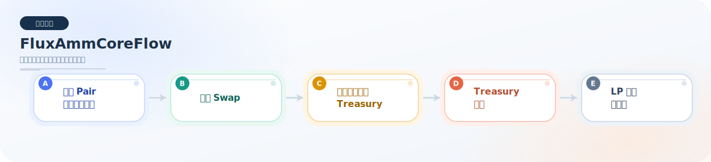

#### `FluxEthWethFlow.test.ts`

- 验证 ETH-WETH 交易对的加池、换币、协议费沉淀全流程。

流程图：

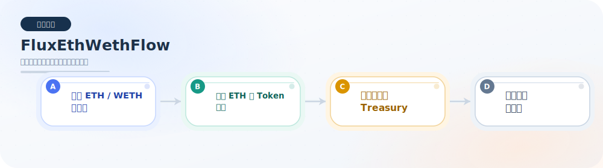

#### `FluxMultiHopRoutingFlow.test.ts`

- 验证双跳 multi-hop swap 跨两个 pair 成功执行。
- 验证两跳输入资产的协议费都能正确进入 treasury。

流程图：

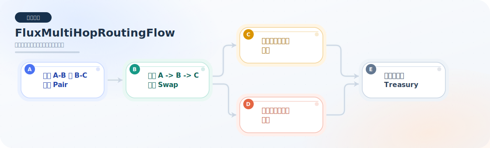

#### `FluxExactOutputRoutingFlow.test.ts`

- 验证 exact-output 多跳路由成功完成。
- 验证两跳输入资产的协议费在 exact-output 路径下仍正确记账。

流程图：

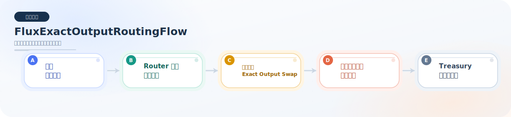

#### `FluxExactOutputEthFlow.test.ts`

- 验证 exact-output token / ETH 路径端到端完成。
- 验证协议费资产仍记在真实输入资产上，而不是被记混。

流程图：

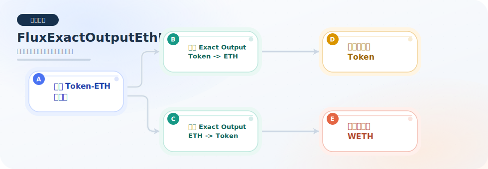

#### `FluxFeeOnTransferRoutingFlow.test.ts`

- 验证 fee-on-transfer token 路由成功执行。
- 验证 treasury 协议费按真实净输入资产计费。

流程图：

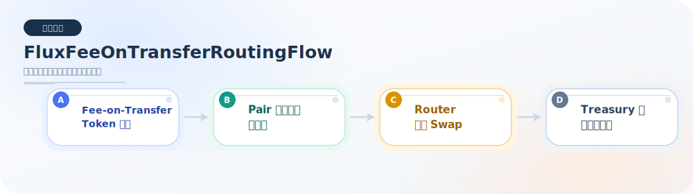

#### `FluxFlashSwapFlow.test.ts`

- 验证 flash swap 回调全额还款后完整成交，并把协议费打入 treasury。
- 验证只归还本金、不归还手续费时会回滚。

流程图：

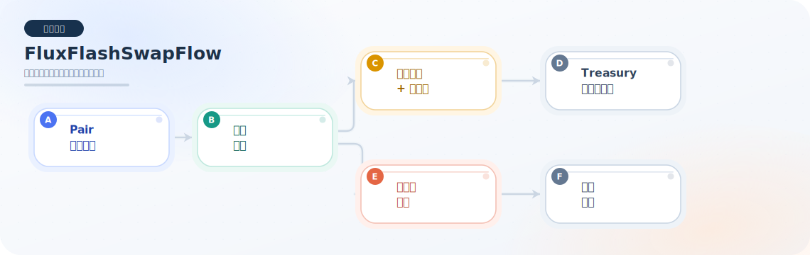

#### `FluxPermitLiquidityFlow.test.ts`

- 验证 LP 不做预授权时，仍可通过 permit 签名退出 token 池与 ETH 池。

流程图：

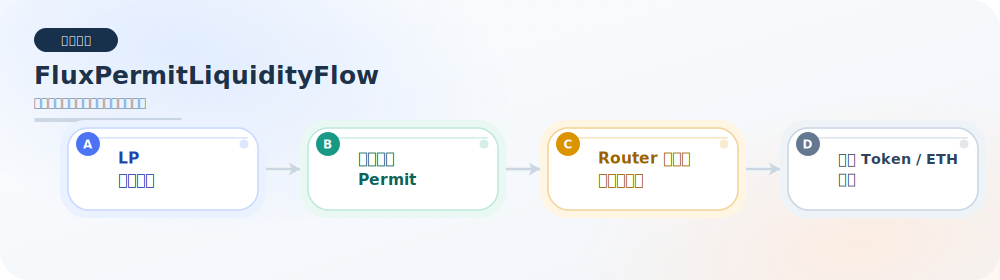

#### `FluxSignedOrderSettlementFlow.test.ts`

- 验证签名订单结算合约与 `Factory / Router / Pair` 的真实联动。
- 验证链下签名订单在链上达价后，可通过真实 AMM 路径完成 `Token -> Token`、`Token -> ETH` 以及“原生币输入语义按 WETH 结算”的订单结算。
- 验证 maker 通过签名触发的批量 nonce 失效、暂停与 restricted executor 策略在集成场景下都能生效。

流程图：

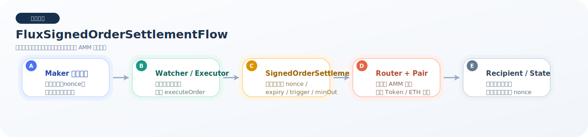

### Treasury / 奖励 / 回购业务链路

#### `FluxProtocolFlow.test.ts`

- 验证 treasury 资助同币质押奖励时，本金与奖励储备不会串账。
- 验证 treasury -> staking rewards 的完整发奖与退出结算流程。

流程图：

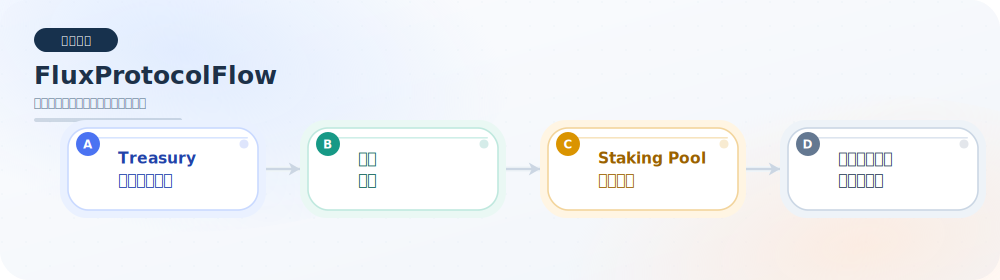

#### `FluxRevenueDistributor.test.ts`

- 验证 treasury 中的 swap fee 经 formal revenue flow 转成 staking rewards。
- 验证 direct treasury FLUX 发奖无需经过 buyback。
- 验证 direct treasury FLUX 可以一路流转到最终 staker payout。
- 验证 distributor pause、treasury mismatch、配置 getter 等关键行为。

流程图：

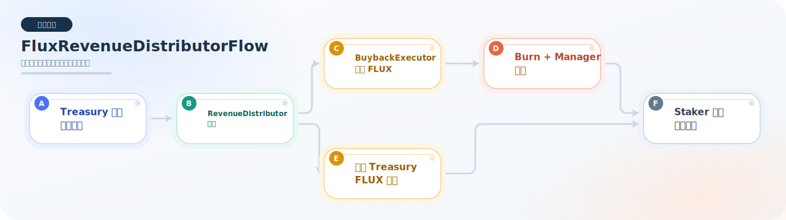

#### `FluxTreasuryOperationsFlow.test.ts`

- 验证 native allocation、approved spender pull、burn、token/native emergency withdraw 的完整链路。

流程图：

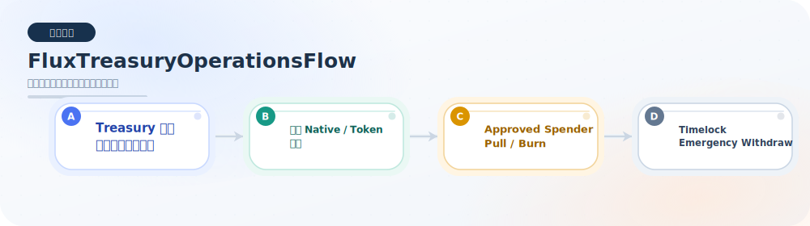

### 单池 / 多池 / 工厂管理链路

#### `FluxSinglePoolFactoryFlow.test.ts`

- 验证工厂创建 managed 单币池。
- 验证 treasury 奖励经 manager 注入池子。
- 验证 staker 最终带着本金与奖励退出。

流程图：

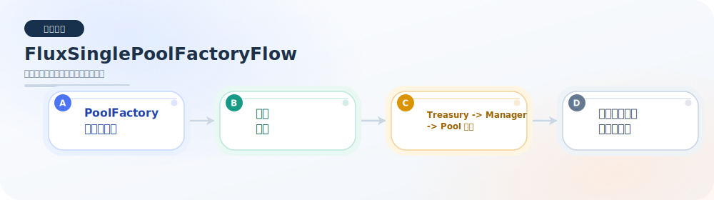

#### `FluxLpMiningFlow.test.ts`

- 验证真实 LP 头寸进入 managed 挖矿池。
- 验证 LP 用户最终取回 LP 本金并领取奖励。

流程图：

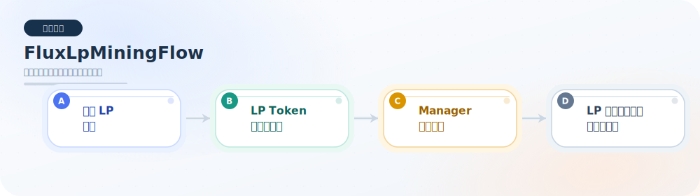

#### `FluxMultiPoolAllocationFlow.test.ts`

- 验证多池按 `allocPoint` 正确分账。
- 验证池子停用后不再继续分到后续奖励。

流程图：

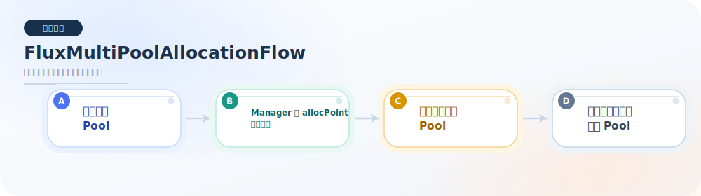

#### `FluxManagedPoolLifecycleFlow.test.ts`

- 验证 managed pool handoff 后旧池用户安全退出。
- 验证同资产可重建 replacement pool，并继续正常使用。

流程图：

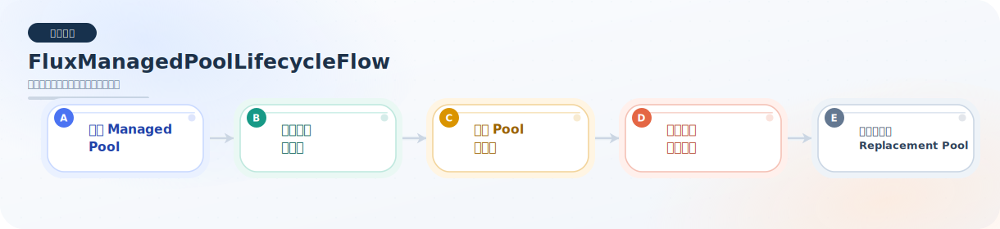

#### `FluxManagedPoolRewardConfigurationFlow.test.ts`

- 验证先走 `manager -> syncRewards` 发奖链路。
- 验证再切换到 `treasury -> notifyRewardAmount` 配置后，旧奖励不丢、新奖励继续可发。

流程图：

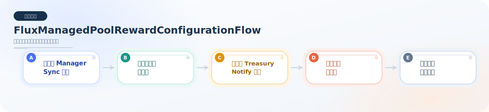

### 暂停传播与跨合约联动

#### `FluxPausePropagationFlow.test.ts`

- 验证 treasury pause 会联动阻断 direct rewards、manager rewards、revenue buybacks。
- 验证 distributor / manager / buybackExecutor 本地 pause 开启时，对应链路会被阻断，解除后才能恢复。

流程图：

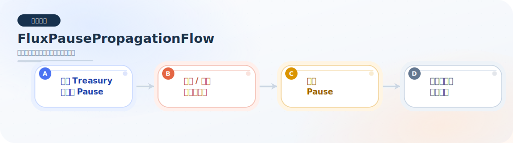

## 执行方式

- 运行全部集成测试：
  - `npm run test:integration`
- 运行单个集成测试文件：
  - `npx hardhat test test/regular/integration/FluxRevenueDistributor.test.ts`

## 当前状态

- 本目录下现有集成测试文件已全部登记到本 README。
- 每个集成测试文件下都已补充图片流程图，便于快速理解业务链路。
- 后续若新增集成测试文件或扩展业务流覆盖点，应同步更新这里的清单与 `assets/` 下对应流程图。
