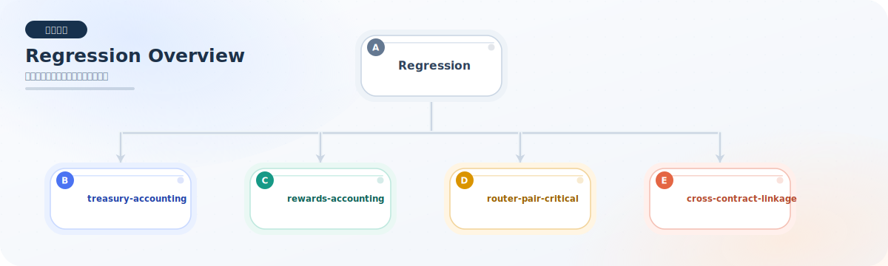

# Regression 测试说明

本目录用于存放“回归测试”。

回归测试的目标不是重复做一遍单元测试或集成测试，而是把已经修过、且后续最容易被改坏的高风险行为单独锁住。

这类测试通常有两个特点：
- 用例尽量短，只锁一个明确的风险点。
- 断言尽量直接，方便以后快速判断是不是某次修改引入了回归。

## 当前目录结构

- `treasury-accounting`
  - 金库记账、额度、支出、原生 ETH 记账相关回归点。
- `rewards-accounting`
  - 奖励储备、用户奖励、队列奖励、分账比例相关回归点。
- `router-pair-critical`
  - Router / Pair 的关键交易路径与敏感边界回归点。
- `cross-contract-linkage`
  - 多合约联动、配置耦合、暂停传播、依赖一致性相关回归点。

## 图示约定

- 回归测试 README 里的流程图按“模块 / 测试文件”粒度维护，不按每个 `it(...)` 单独作图。
- 这样做是为了突出高风险行为分组，同时避免回归文档因为图太细而变得难维护。

模块总览图：

## 当前已完成的回归测试

### treasury-accounting

- `FluxTreasuryAccountingRegression.test.ts`
  - 锁定 treasury 暂停时仍可继续接收 AMM 协议费，但不能执行支出。
  - 锁定 guardian 只能暂停 treasury，而恢复权仍然只属于 multisig。
  - 锁定 approved spender 不能绕过 treasury 记账，直接拿到底层 ERC20 allowance。
  - 锁定 operator 变更必须经过 multisig schedule 与 timelock 到期，不能提前生效。
  - 锁定 treasury 对非标准 ERC20 的 approved pull 路径仍保持兼容。
  - 锁定即使 token / recipient 已加入白名单，只要 daily cap 未配置，allocate 仍会被阻断。
  - 锁定原生 ETH 使用 `address(0)` 的独立 spend cap，不会和 ERC20 cap 串账。
  - 锁定 `burnApprovedToken` 与 `pullApprovedToken` 共用 spender allowance 和 `dailySpendCap` 记账。
  - 锁定 `executeRevokeSpender` 会立刻清空残余额度。
  - 锁定 token / native 双额度在同一天同时消费时仍各记各账。
  - 锁定 timelock 紧急提取路径与普通支出隔离，即使 treasury 已暂停也能执行事故转移。
  - 锁定 emergency `operationId` 与参数强绑定，且执行后不能直接重放。
  - 锁定 canceled emergency operation 必须重新 schedule 后才能再次执行。

### rewards-accounting

- `FluxRewardsAccountingRegression.test.ts`
  - 锁定同币质押时本金和奖励储备不会串账。
  - 锁定同币质押错峰入场时，先入场用户收益更高且总奖励严格守恒。
  - 锁定 manager 的 pending 奖励在 `syncRewards` 后必须清零并转入 pool。
  - 锁定 `recoverUnallocatedRewards` 不能回收用户已归属但未领取的奖励。
  - 锁定无质押场景下 queued reward 可以被完整回收。
  - 锁定多池 `allocPoint` 分账比例稳定，且池子停用后不会继续吃到新增奖励。
  - 锁定多池小额发奖时 manager 的 rounding carry-forward 不会丢失，较小 allocPoint 池在累计后仍能领取奖励。
  - 锁定 LP 奖励池在用户退出后残留的 queued dust 可以被 `recoverManagedPoolUnallocatedRewards` 正确回收。
  - 锁定 managed pool 的 `recoverManagedPoolUnallocatedRewards` 不能吞掉已归属给用户的奖励。

### router-pair-critical

- `FluxRouterPairCriticalRegression.test.ts`
  - 锁定 exact-output 多跳路径的双跳手续费记账。
  - 锁定 exact-input 多跳路径的双跳手续费记账。
  - 锁定 exact-output ETH 路径按真实输入资产记协议费，不会把 token / WETH 记混。
  - 锁定 token-WETH 的 exact-input / exact-output 各类 swap 入口在协议费资产归属上保持一致。
  - 锁定 fee-on-transfer 路径按真实净输入计费。
  - 锁定 fee-on-transfer 的 ETH supporting 路径也按真实输入资产记协议费。
  - 锁定 permit 移除流动性不依赖预授权。
  - 锁定非 permit 的 `removeLiquidityETH` 路径也能稳定赎回 token 和原生 ETH。
  - 锁定 flash swap 成功回调时协议费仍会正确沉淀到 treasury。
  - 锁定 flash swap 不能只还本金。
  - 锁定超小额 swap 的 rounding 行为，以及 full unwind 后最小流动性仍保留在 Pair 内。

### cross-contract-linkage

- `FluxCrossContractLinkageRegression.test.ts`
  - 锁定 `FluxRevenueDistributor`、`FluxBuybackExecutor`、`FluxMultiPoolManager` 的 treasury 指针不一致时必须立即拒绝执行。
  - 锁定 formal buyback 成功链路会把 treasury 手续费正确拆分为回购、销毁与 manager 奖励分发。
  - 锁定 direct treasury FLUX 发奖也能完整经过 manager / pool 同步并最终兑现给 staker。
  - 锁定 buyback 结果不能被重定向到 treasury 之外地址。
  - 锁定 treasury 迁移后 buyback 的 `defaultRecipient` 也会同步迁移，不能残留旧 treasury。
  - 锁定 treasury pause 后，manager 奖励分发、distributor 直发奖励、buyback 回购分发都会被联动阻断。
  - 锁定 managed pool 所有权移交后，旧池索引会被清理，且同一质押资产可以重新创建替代池。
  - 锁定 managed pool 交接不能转给当前 owner 自己，避免出现无效 handoff。
  - 锁定 managed pool handoff 后，旧池用户仍能安全退出并领取旧奖励，替代池也能继续正常发奖退出。
  - 锁定 self-sync managed pool 的奖励配置不能被拆成 rewardSource / rewardNotifier 半更新。
  - 锁定 poolFactory owner 迁移后，新 owner 仍能继续管理既有 managed pool。
  - 锁定 distributor / manager / buybackExecutor 的 operator 权限都必须通过 `setOperator` 管理，不能直接 `grantRole`。
  - 锁定 managed pool 从 `manager + syncRewards` 切换到 `treasury + notifyRewardAmount` 后，旧奖励不丢失且新奖励仍可继续发放。
  - 锁定 distributor / manager / buybackExecutor 的本地 pause 清除前，分发链路和回购链路都不会提前恢复。

## 执行方式

- 运行全部回归测试：
  - `npm run test:regression`

## 当前状态

- 当前 README 中原先列出的“计划补充的回归点”已全部补齐并转入已覆盖清单。
