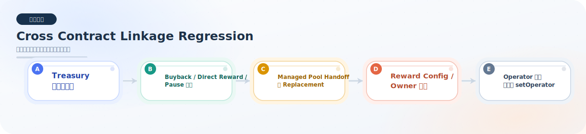

# cross-contract-linkage

本目录用于存放跨合约联动类回归测试。

## 当前已完成的回归测试

### `FluxCrossContractLinkageRegression.test.ts`

已覆盖的回归点：

- manager 与 buyback executor 的 treasury 指针一旦分叉，`FluxRevenueDistributor` 的两个入口都会拒绝执行。
- formal buyback 成功链路会把 treasury 内交易手续费正确拆分为“回购后销毁 + manager 奖励分发”。
- direct treasury FLUX 发奖也必须经过 manager / pool 同步后真正进入 staker 账户，不能只停留在 pending 状态。
- buyback 执行结果不能被重定向到 treasury 之外地址，避免回购资产绕开金库。
- treasury 迁移后，buybackExecutor 的 `defaultRecipient` 也必须同步迁移，不能残留旧 treasury。
- treasury pause 会向上游传播，阻断 manager 发奖、distributor 直发奖励、buyback 回购分发。
- managed pool 交接时会同步清理工厂映射与 manager 活跃状态，并允许同资产重建新池。
- managed pool 交接不能“转给当前 owner 自己”，避免治理流程出现无效 handoff。
- managed pool 交接后，旧池用户仍必须能安全退出领取已归属奖励，替代池也必须继续正常发奖退出。
- managed pool 仍处于 self-sync 模式时，奖励配置必须原子切换，不能拆成 rewardSource / rewardNotifier 半更新。
- poolFactory owner 迁移后，新的 owner 也必须继续能管理已经存在的 managed pool。
- distributor、manager、buybackExecutor 的 operator 权限都只能通过 `setOperator` 变更，不能被 `grantRole` 直接绕过。
- managed pool 奖励配置从 `manager -> pool.syncRewards` 切换到 `treasury -> notifyRewardAmount` 后，旧奖励累计与新奖励发放都保持正确。
- distributor、manager、buybackExecutor 任一组件本地暂停时，对应分发链路都必须阻断，并且只有解除暂停后才允许恢复执行。

模块总览图：

## 当前状态

- 原先列出的计划补充点已全部补齐。
