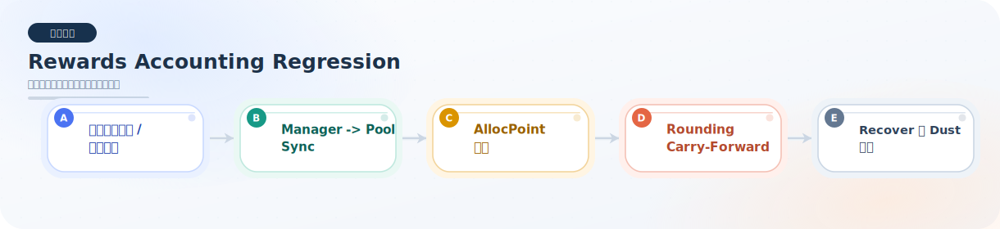

# rewards-accounting

本目录用于存放与奖励会计相关的回归测试。

## 当前已完成的回归测试

### `FluxRewardsAccountingRegression.test.ts`

已覆盖的回归点：

- 同币质押时，池子持有的本金与 `rewardReserve` 的奖励会计必须分离。
- 同币质押存在错峰入场时，先入场用户必须获得更高奖励，同时总奖励仍要严格守恒。
- `syncRewards` 之后，manager 的 `pendingPoolRewards` 必须归零，奖励资产必须进入 pool。
- 用户已经归属但尚未领取的奖励，不能被 `recoverUnallocatedRewards` 回收走。
- 无质押用户时进入 `queuedRewards` 的奖励，必须可以被 owner 完整回收。
- 多池按 `allocPoint` 分账时，各池分配比例必须正确，且停用池不会继续收到后续奖励。
- 多池小额发奖时，manager 的 rounding carry-forward 必须持续累计，直到小 allocPoint 池也能真正领到奖励。
- LP 池在用户退出后若仍残留 `queuedRewards` dust，必须可以通过 `recoverManagedPoolUnallocatedRewards` 被工厂正确回收。
- managed pool 场景下，`recoverManagedPoolUnallocatedRewards` 只能回收未分配奖励，不能吞掉用户已归属奖励。

模块总览图：

## 当前状态

- 原先列出的计划补充点已全部补齐。
