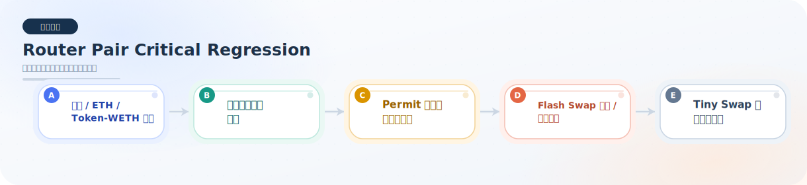

# router-pair-critical

本目录用于存放 Router / Pair 关键路径相关的回归测试。

## 当前已完成的回归测试

### `FluxRouterPairCriticalRegression.test.ts`

已覆盖的回归点：

- exact-output 多跳路径下，两跳输入资产都必须正确向 treasury 支付协议费。
- exact-input 多跳路径下，两跳输入资产也必须分别正确向 treasury 支付协议费。
- exact-output ETH 路径下，协议费必须记在真实输入资产上，不会把 token / WETH 记混。
- token-WETH 路径在 exact-input / exact-output 的不同 swap 入口下，协议费资产归属保持一致。
- fee-on-transfer 路径必须按真实净输入计费，而不是按名义输入计费。
- fee-on-transfer 的 ETH supporting 路径也必须分别把协议费记在真实输入资产 WETH / feeToken 上。
- permit 移除流动性路径必须在无预授权前提下正常工作。
- 非 permit 的 `removeLiquidityETH` 路径也必须稳定赎回 token 和原生 ETH。
- flash swap 成功回调时，协议费也必须稳定沉淀到 treasury，不能只锁失败分支。
- flash swap 必须归还带手续费的金额，不能只还本金。
- 超小额 swap 的协议费 rounding 行为必须稳定。
- full unwind 后 Pair 仍保留最小流动性，不会把池子彻底烧空。

模块总览图：

## 当前状态

- 原先列出的计划补充点已全部补齐。
