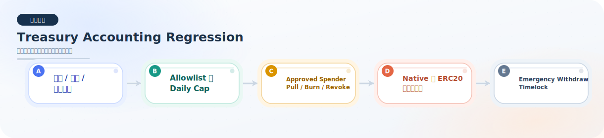

# treasury-accounting

本目录用于存放与金库记账、额度、支出约束相关的回归测试。

## 当前已完成的回归测试

### `FluxTreasuryAccountingRegression.test.ts`

已覆盖的回归点：

- treasury 暂停后，AMM 交易仍然可以把协议手续费打入 treasury。
- treasury 暂停后，operator 不能继续从 treasury 对外分配资产。
- guardian 可以暂停 treasury，但只有 multisig 可以恢复 treasury。
- approved spender 不能通过 ERC20 `allowance` 直接绕过 treasury 记账。
- approved spender 只能通过 `pullApprovedToken` 等 treasury 入口消耗额度。
- operator 变更只能由 multisig schedule，且 timelock 未到期前不能提前执行。
- treasury 对非标准 ERC20 的 approved pull 路径也必须继续兼容。
- 仅完成 token / recipient 白名单还不够；如果 daily cap 未配置，allocate 仍必须被阻断。
- 原生 ETH 使用 `address(0)` 的单独 spend cap 记账。
- 原生 ETH 的 spend cap 不会污染 ERC20 的 `spentToday` 统计。
- token 与 native 双 spend cap 在同一天同时消费时仍保持独立。
- `burnApprovedToken` 会消耗 approved spender 剩余额度，并占用同一套 `dailySpendCap` 记账。
- `executeRevokeSpender` 会立即清空剩余额度，防止 spender 继续提走残留资产。
- `executeEmergencyWithdraw` / `executeEmergencyWithdrawETH` 与普通 allocate 路径隔离，即使 treasury 已暂停也能在 timelock 到期后执行。
- emergency withdraw 的 `operationId` 与参数强绑定，且执行后不能被直接重放。
- emergency withdraw 被 cancel 后，必须重新 schedule 才能再次执行。

模块总览图：

## 当前状态

- 原先列出的计划补充点已全部补齐。
